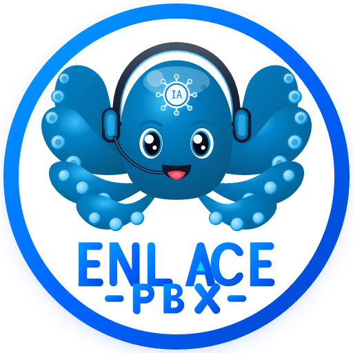

<p align="center">
  <a href="https://enlace.slz.br" target="_blank" rel="noopener noreferrer">
    
  </a>
</p>

<p align="center">
  <strong>Plataforma Omnichannel, Telefonia IP Asterisk 20 LTS & AI Gateway Cognitivo</strong><br>
  <em>Simples, Aberta, Segura e Desenvolvida com Orgulho no Brasil 🇧🇷</em>
</p>

<p align="center">
  
  
  
  
  
  
</p>

---

## 📖 Visão Geral

O **Enlace-PBX Enterprise** é uma central telefônica IP de nova geração concebida para superar os limites dos PABX legados. Construída sobre um núcleo puro **Asterisk 20 LTS (PJSIP)**, a plataforma integra nativamente:

1. **Inteligência Artificial Cognitiva (Google Gemini):** Agentes de voz autônomos (MaIA), transcrição fonética em tempo real, detecção de sentimentos e avaliação automática de qualidade de atendimento (LLM-as-a-Judge).
2. **Contact Center Omnichannel:** Hub unificado combinando chamadas de voz com atendimento via WhatsApp (Meta Cloud API oficial), Webchat e integração bidirecional com os principais CRMs do mercado (HubSpot, Pipedrive e RD Station).
3. **Webphone WebRTC Embutido:** Softphone no navegador baseado em padrões WSS e codecs de alta definição (Opus 48kHz, G.722 e G.711) com discador interativo DTMF e teclado telefônico.
4. **Editor Visual de URA (IVR Flow Builder):** Desenhe menus de atendimento multinível diretamente pelo navegador, com simulador interativo de passos e geração automática de Dialplan Asterisk (`extensions.conf`).
5. **NOC & Monitoramento em Tempo Real:** Painel de operações com métricas de canais ativos, latência de rede, console interativo Asterisk CLI e trilha de auditoria LGPD imutável.

---

## 🐙 Identidade Visual & Mascote Oficial

<p align="center">
  
</p>

A marca do **Enlace-PBX** traz como símbolo oficial o **Polvo Tecnológico com Headset e IA**:
- **O Mascote:** Um simpático polvo em tons de azul elétrico e celeste, usando headset de atendimento profissional de call center e um circuito neural brilhante na testa com a inscrição **IA**. Ele representa a versatilidade de múltiplos canais simultâneos (tentáculos operacionais) com a precisão de um cérebro cognitivo centralizado.
- **Tipografia:** Tipografia geométrica em degradê azul royal com um delta/seta ciano estilizado no centro da letra **A** de "ENLACE".
- **Arquivos de Mídia Disponíveis:**
  - `public/logo.png` — Logo oficial horizontal de alta resolução (1000 × 480 px).
  - `public/logo.svg` — Vetor SVG escalável do logotipo horizontal.
  - `public/logo-icon.png` — Emblema circular/quadrado do mascote (512 × 512 px) para ícones de sistema e PWA.
  - `public/logo-icon.svg` — Vetor SVG do emblema circular do mascote.

---

## 🏛️ Arquitetura de Módulos

```text
                                  ┌─────────────────────────────┐
                                  │      Navegador Web / PWA    │
                                  │ (React 18 + Tailwind + WSS) │
                                  └──────────────┬──────────────┘
                                                 │ HTTPS (443) / WSS
                                                 ▼
┌─────────────────────────────────────────────────────────────────────────────┐
│                             NGINX Reverse Proxy                             │
│       (Certificados Let's Encrypt SSL + Proxy HTTP/3000 + Proxy WSS/8089)   │
└──────────────────────┬──────────────────────────────────────┬───────────────┘
                       │ HTTP / API REST                      │ WSS (8089)
                       ▼                                      ▼
┌──────────────────────────────────────────────┐ ┌────────────────────────────┐
│      Enlace-PBX BFF (Node.js 20 Express)     │ │ Asterisk 20 LTS Core (SIP) │
│  ├─ Multi-Tenant Policy Engine (RBAC)        │ │  ├─ res_pjsip (Endpoints) │
│  ├─ Google Gemini 2.5 SDK (AI Gateway)       │ │  ├─ res_http_websocket     │
│  ├─ Webhooks Oficiais WhatsApp (Meta Cloud)  │ │  ├─ res_srtp / res_crypto  │
│  ├─ Orquestrador de Dialplan & IVR           │ │  ├─ app_audiosocket (ARI)  │
│  ├─ Faturamento / Tarifador Pré e Pós        │ │  └─ res_ari_channels       │
│  └─ Snapshots & Motor de Backup              │ └──────────────┬─────────────┘
└──────────────────────┬───────────────────────┘                │
                       │ ARI WebSocket (8088)                   │ Audio RTP (10000-20000)
                       └────────────────────────────────────────┘
```

### 🧩 Detalhamento dos Módulos do Sistema (27 Módulos Enterprise)

| Módulo | Finalidade | Tecnologias Utilizadas |
| :--- | :--- | :--- |
| **NOC & Dashboard Executivo** | Métricas em tempo real, canais ativos, MOS, CPU e gráficos de tráfego | Recharts, SSE (Server-Sent Events) |
| **VPNs WireGuard & ZeroTier** | Túneis seguros entre matriz e filiais, monitoramento de latência e perda de pacotes | WireGuard, ZeroTier-One, Telemetria |
| **Segurança & Firewall** | Defesa contra ataques SIP (SIPVicious), Fail2ban integrado e controle do UFW | Fail2ban, UFW, Helmet, Rate-Limit |
| **PJSIP Core & Ramais** | Gestão de ramais SIP físicos e WebRTC, senhas dinâmicas e codecs Opus/G.711 | Asterisk 20, Teluu PJSIP, TLS |
| **Troncos & DIDs** | Interconexão com operadoras VoIP, números virtuais de entrada e portabilidade | PJSIP Trunks, E.164, Regras DID |
| **Rotas de Saída & LCR** | Roteamento de menor custo, planos de discagem BR (fixo, móvel, 0800, DDI) | Dialplan `extensions.conf`, LCR Engine |
| **Filas ACD & Call Center** | Distribuição inteligente (ringall, roundrobin), agentes com pausa e SLA ao vivo | `app_queue`, Monitoramento de SLA |
| **Campanhas de Discagem** | Discagem ativa preditiva e power dialer com controle de abandono | Motor de Discagem Asterisk, Filas |
| **URA Visual (IVR Builder)** | Criação em fluxograma de árvores de atendimento com áudios e simulador | Canvas interativo, DTMF, Dialplan |
| **Omnichannel & WhatsApp** | Atendimento unificado multicanal integrado à Meta Cloud API v20.0 oficial | Meta Webhooks 443, Chat unificado |
| **CRM Hub 360 & Contatos** | Sincronização bidirecional com HubSpot, Pipedrive, RD Station e Salesforce | Webhooks REST, Customer 360 |
| **AI Gateway (MaIA)** | Agentes cognitivos de voz com áudio em tempo real e Customer Memory | Google Gemini Flash/Live, ARI Stasis |
| **CDR & Gravações** | Bilhetagem com filtros avançados, player WAV/MP3 e transcrição automática | Web Speech API, Storage de gravações |
| **Billing & Tarifador** | Planos pré/pós, tarifação por minuto e relatórios de faturamento em PDF | Motor de Tarifação, JsPDF AutoTable |
| **Asterisk CLI Terminal** | Console interativo no navegador (`asterisk -rvvvv`) e recarga de serviços | WebSocket Terminal, Asterisk AMI |
| **Snapshots & Rollback** | Backup instantâneo de toda a configuração com restauração em 1 clique | Snapshots JSON/SQL, Motor de Rollback |
| **Auditoria & LGPD** | Trilha imutável de acessos, escuta de gravações e logs com autor e timestamp | Logs criptografados, Auditoria SIEM |
| **Infraestrutura & SSL** | Detecção de IP WAN/LAN, NAT Traversal e certificados Let's Encrypt | Certbot, NGINX SSL, IP Tools |

---

## ⚙️ Procedimentos de Instalação e Deploy (Produção)

O **Enlace-PBX Enterprise** foi desenvolvido e homologado para servidores físicos dedicados ou VPS rodando **Debian 12 (Bookworm)** ou **Ubuntu 22.04 / 24.04 LTS**.

### 🖥️ Requisitos Mínimos e Recomendados

| Recurso | Mínimo | Recomendado (Call Center / IA) |
| :--- | :--- | :--- |
| **Processador** | 2 vCPUs | 4 vCPUs ou mais (compilação rápida e codecs Opus) |
| **Memória RAM** | 2 GB (com 2 GB Swap) | 4 GB a 8 GB RAM |
| **Armazenamento** | 20 GB SSD | 50 GB SSD NVMe (armazenamento de gravações WAV) |
| **Rede** | 1 Endereço IPv4 Fixo | 1 Endereço IPv4 Fixo + FQDN DNS apontado |

---

### 🛡️ Matriz de Portas do Firewall (UFW / Edge Router)

| Porta / Protocolo | Serviço | Descrição |
| :--- | :--- | :--- |
| `22/tcp` | SSH | Acesso administrativo remoto |
| `80/tcp` | HTTP ACME | Validação de desafios SSL Let's Encrypt |
| `443/tcp` | HTTPS | Dashboard Web, PWA, Webphone e Webhooks WhatsApp Cloud |
| `5060/udp` | SIP UDP | Sinalização PJSIP padrão de telefones IP e troncos |
| `5061/tcp` | SIP TLS | Sinalização PJSIP criptografada |
| `8089/tcp` | WebRTC WSS | WebSocket seguro do Asterisk para o Webphone |
| `10000-20000/udp` | RTP Media | Fluxos bidirecionais de áudio de voz |
| `51820/udp` | WireGuard | VPN segura entre filiais |

---

### 🚀 Método 1: Deploy Automatizado com `deploy.sh` (Recomendado)

O instalador interativo realiza toda a preparação da máquina do zero:
1. Instala utilitários, NGINX, Certbot e Node.js 20 LTS.
2. Detecta automaticamente o endereço IPv4 público e solicita o domínio FQDN.
3. Compila a aplicação frontend e backend (`npm run build`).
4. Compila opcionalmente o Asterisk 20 LTS puro com PJSIP, Opus, WebRTC e AudioSocket.
5. Configura o proxy reverso NGINX com cabeçalhos WebSocket e gera o certificado SSL Let's Encrypt.
6. Habilita as regras estritas no Firewall UFW sem bloquear a sessão SSH ativa.
7. Registra o serviço no PM2 garantindo inicialização automática no boot do sistema.

```bash
# 1. Acesse o servidor Linux via SSH como root
ssh root@seu-servidor-ip

# 2. Clone o repositório para o diretório padrão
git clone https://github.com/enlace-telecom/enlace-pbx.git /opt/enlace-pbx
cd /opt/enlace-pbx

# 3. Conceda permissão e execute o instalador
chmod +x deploy.sh install-enlace-pbx.sh
sudo ./deploy.sh
```

---

### 🛠️ Método 2: Deploy Passo a Passo Manual

#### 1. Instalar Pacotes Base e Node.js 20
```bash
apt-get update -y && apt-get install -y curl git build-essential ufw nginx certbot python3-certbot-nginx
curl -fsSL https://deb.nodesource.com/setup_20.x | bash -
apt-get install -y nodejs
npm install -g pm2
```

#### 2. Compilar o Asterisk 20 LTS
```bash
chmod +x install-enlace-pbx.sh
./install-enlace-pbx.sh
```

#### 3. Configurar Variáveis de Ambiente e Compilar o Enlace-PBX
```bash
cp .env.example .env
nano .env # Preencha GEMINI_API_KEY, PBX_DOMAIN e PBX_PUBLIC_IP
npm install --legacy-peer-deps
npm run build
```

#### 4. Configurar o NGINX
Crie `/etc/nginx/sites-available/enlace-pbx`:
```nginx
server {
    listen 80;
    server_name pbx.suaempresa.com.br;
    client_max_body_size 50M;

    location / {
        proxy_pass http://127.0.0.1:3000;
        proxy_http_version 1.1;
        proxy_set_header Upgrade $http_upgrade;
        proxy_set_header Connection "upgrade";
        proxy_set_header Host $host;
        proxy_set_header X-Real-IP $remote_addr;
        proxy_set_header X-Forwarded-For $proxy_add_x_forwarded_for;
        proxy_set_header X-Forwarded-Proto $scheme;
    }

    location /ws {
        proxy_pass http://127.0.0.1:8089/ws;
        proxy_http_version 1.1;
        proxy_set_header Upgrade $http_upgrade;
        proxy_set_header Connection "upgrade";
        proxy_set_header Host $host;
    }
}
```
Ative o site e emita o certificado SSL:
```bash
ln -sf /etc/nginx/sites-available/enlace-pbx /etc/nginx/sites-enabled/
rm -f /etc/nginx/sites-enabled/default
nginx -t && systemctl reload nginx
certbot --nginx -d pbx.suaempresa.com.br --redirect
```

#### 5. Inicializar o Serviço com PM2
```bash
pm2 start dist/server.cjs --name "enlace-pbx"
pm2 save
pm2 startup
```

---

## 📋 Comandos Operacionais Frequentes

| Ação | Comando |
| :--- | :--- |
| **Ver logs da aplicação** | `pm2 logs enlace-pbx` |
| **Reiniciar o PBX Web** | `pm2 restart enlace-pbx` |
| **Acessar o terminal do Asterisk** | `asterisk -rvvvv` |
| **Recarregar Dialplan** | `asterisk -rx "dialplan reload"` |
| **Recarregar PJSIP** | `asterisk -rx "pjsip reload"` |
| **Ver status do Firewall** | `ufw status verbose` |
| **Testar renovação do SSL** | `certbot renew --dry-run` |

---

## 🛠️ Ambiente de Desenvolvimento Local

```bash
# Instalar dependências
npm install

# Iniciar servidor unificado (Express + Vite HMR)
npm run dev
```
O aplicativo estará disponível em `http://localhost:3000`.

---

## 🔒 Segurança & Conformidade com LGPD (Enterprise Security)
- **Autenticação JWT:** Acesso restrito ao painel com tokens JSON Web Tokens (JWT) de curta duração.
- **Defesas de Borda:** Middleware integrado com `Helmet` (Headers HTTP Seguros), `CORS` estrito e `Express Rate Limiting` (mitigação DDoS e força bruta nas rotas de login).
- **Arquitetura Backend-for-Frontend (BFF):** Todas as credenciais de operadoras, chaves secretas do Google Gemini e tokens Meta ficam protegidas exclusivamente no backend (Node.js).
- **Motor Anti-Fraude (Toll Fraud):** Monitoramento de limites transacionais de DDI e integração nativa com Fail2Ban.
- **Trilha de Auditoria Imutável (SIEM-ready):** Todas as alterações em ramais, rotas e acessos a gravações telefônicas são registradas no log de auditoria com IP, timestamp e autor.

---

## 🇧🇷 Créditos & Licença
Desenvolvido por **André LJP** e equipe **Enlace Telecom** sob licença comercial / código aberto.  
Dúvidas e suporte técnico: [slzenlace@gmail.com](mailto:slzenlace@gmail.com) | [enlace.slz.br](https://enlace.slz.br)

